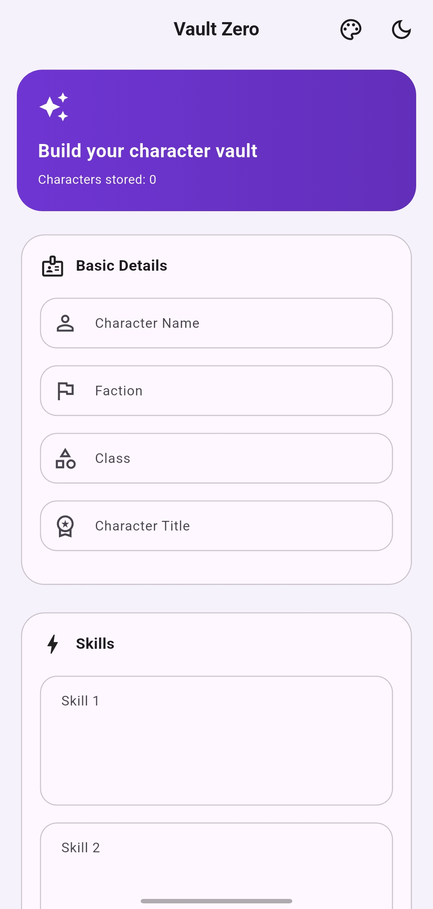
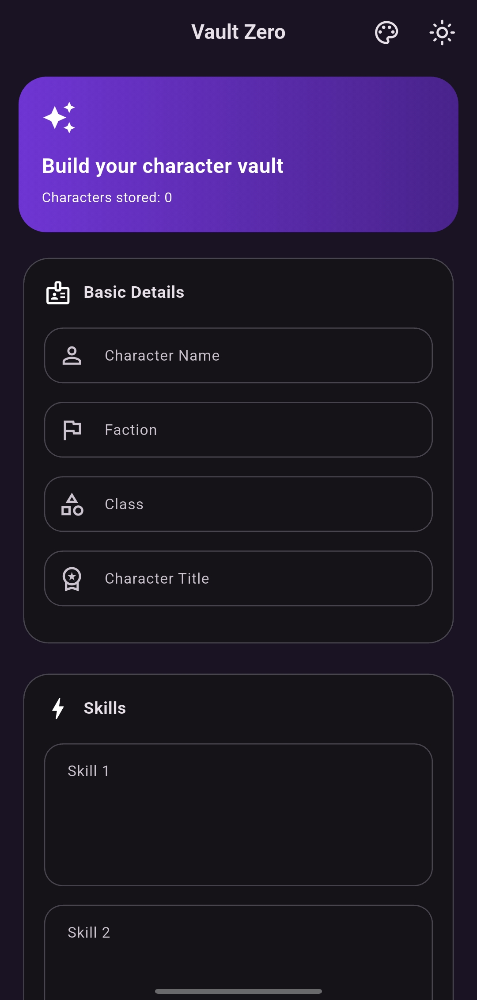
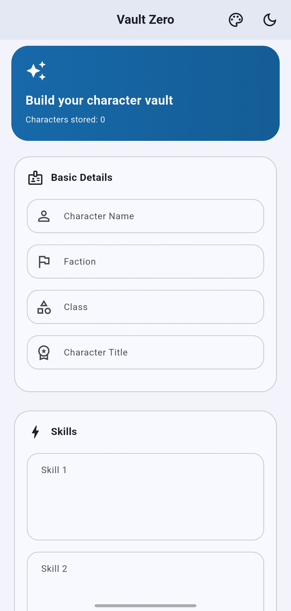
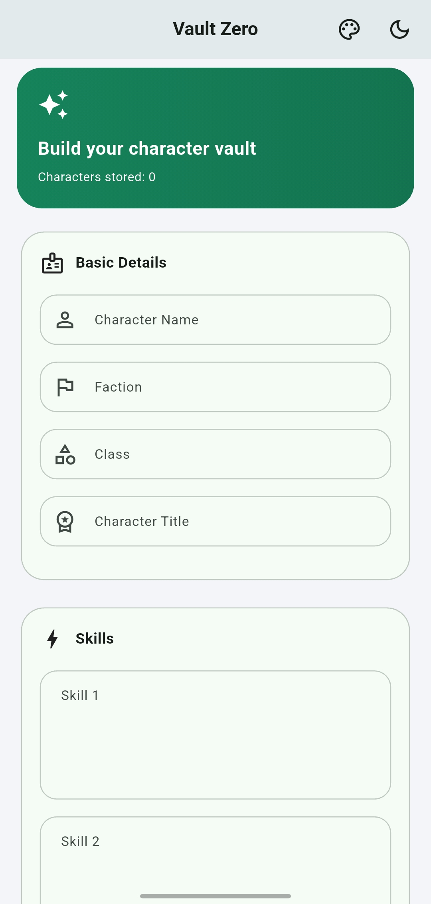
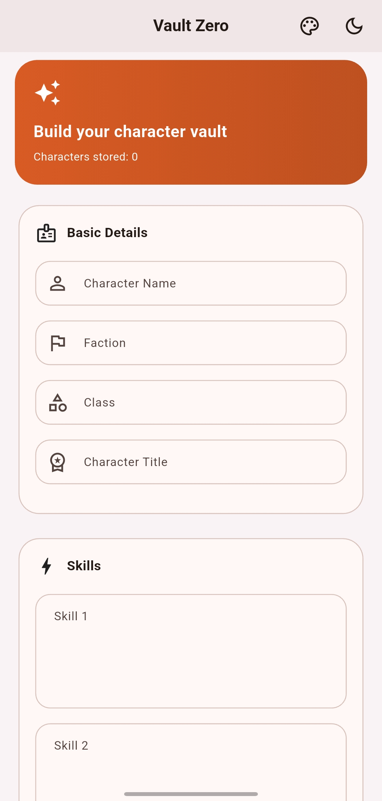
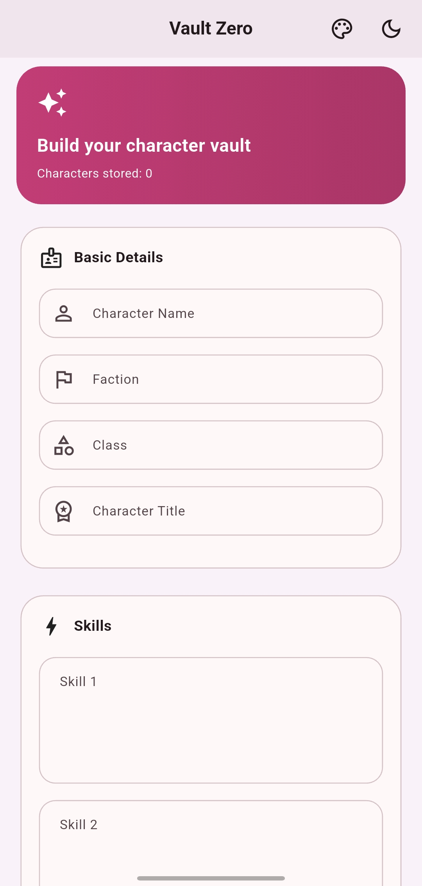

# Vault Zero

  

<b>Offline by design. Fast by default.</b>

A premium offline-first character manager for Android.

---

## Screenshots

### Home

| Light | Dark |
|-------|------|
|  |  |

### Themes

| Purple | Blue |
|--------|------|
|  |  |

| Green | Orange | Pink |
|-------|--------|------|
|  |  |  |

---

## Download

Download the latest APK from the
**GitHub Releases** page.

Current version:

**v1.0.0**

---

## Roadmap

Future improvements include:

- Backup & Restore
- Advanced search & filtering
- Additional export formats
- Theme refinements
- UI & UX improvements
- Performance optimizations

---

## Contributing

Ideas, bug reports and feature suggestions are welcome.

If you discover an issue or have an improvement in mind, open an Issue before submitting large changes.

---

## License

Vault Zero is released under the MIT License.

See the LICENSE file for details.